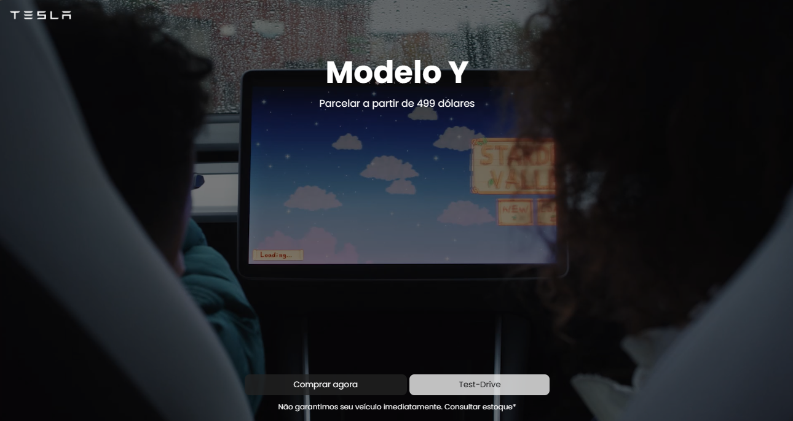
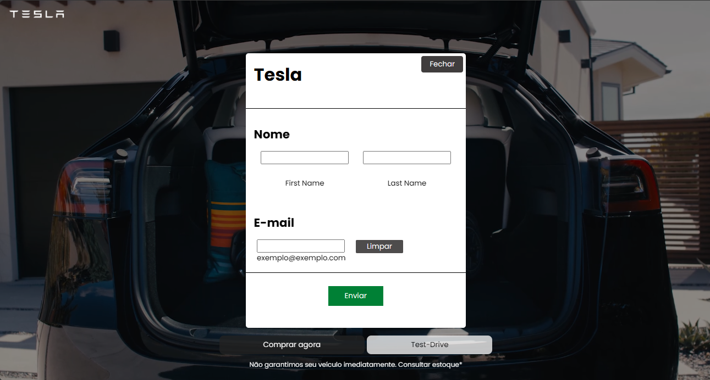

<p align="left">  </p>
<p>
   link da pagina web
  <a href="https://edineladelso.github.io/ProjetoTesla/" target="_blank">
    https://github.com/edineladelso/calculadoraPython
  </a>
</p>
# Projeto Tesla

Bem-vindo ao **Projeto Tesla**, um projeto de venda de carros inspirado nos padrões mais modernos do desenvolvimento frontend. Este repositório representa um portfólio avançado, focado em práticas de excelência, design responsivo e experiência do usuário (UX) diferenciada.

## 🚗 Sobre o Projeto

O Projeto Tesla é uma aplicação web para apresentação e venda de carros, simulando um ambiente real de e-commerce automotivo. Ele foi desenvolvido com foco em usabilidade, performance, acessibilidade e escalabilidade, utilizando as melhores práticas de HTML, CSS e JavaScript.

## 🎯 Objetivos

- Criar uma plataforma visualmente atraente e responsiva para venda de carros
- Demonstrar domínio avançado em desenvolvimento frontend
- Implementar animações e interações modernas para potencializar a experiência do usuário
- Aplicar princípios de UI/UX e design thinking
- Garantir compatibilidade multiplataforma (desktop, tablet e mobile)

## 🛠️ Tecnologias Utilizadas

- **HTML5**: Estrutura semântica e acessível
- **CSS3**: Grid/Flexbox, animações, responsividade e customizações avançadas
- **JavaScript ES6+**: Interatividade, manipulação de DOM e simulação de funcionalidades dinâmicas

## ✨ Funcionalidades Principais

- Página inicial com apresentação de modelos Tesla
- Galeria de carros com navegação fluida
- Detalhes individuais dos veículos
- Simulação de compra e formulário de contato
- Menu responsivo
- Animações de transição e efeitos interativos
- Design adaptativo para todos os dispositivos

## 🖼️ Demonstração





## 🚀 Como Executar Localmente

1. Clone o repositório:
   ```bash
   git clone https://github.com/edineladelso/ProjetoTesla.git
   ```
2. Navegue até a pasta do projeto:
   ```bash
   cd ProjetoTesla
   ```
3. Abra o arquivo `index.html` no seu navegador favorito.

> *Não é necessário backend para testar, todo o projeto é estático e pronto para deploy no GitHub Pages ou qualquer serviço semelhante.*

## 💡 Diferenciais Técnicos

- Uso avançado de CSS para animações e transições
- Estrutura de componentes para facilitar manutenção
- Semântica e acessibilidade em todos os elementos
- Código limpo e comentado para fácil entendimento

## 📁 Estrutura de Pastas

```
ProjetoTesla/
├── assets/         # Imagens, ícones e mídias
├── css/            # Folhas de estilo
├── js/             # Scripts JavaScript
├── index.html      # Página principal
├── README.md       # Documentação
└── ...
```

## 🏆 Para Portfólio

Este repositório é ideal para destacar competências em:

- Frontend avançado
- UI/UX moderno
- Responsividade e Mobile First
- Performance e boas práticas de código

## 📬 Contato

Fique à vontade para entrar em contato e discutir melhorias ou oportunidades:

- [LinkedIn](https://www.linkedin.com/in/seu-usuario)
- [GitHub](https://github.com/edineladelso)
- Email: marenguale@gmail.com

---

> **Projeto desenvolvido com dedicação, criatividade e atenção aos detalhes.**
